# Multi-Agent Architecture Visualization Specifications

**Date:** 2025-11-22
**Purpose:** Detailed specifications for technical diagrams showing the 15-agent OpenDraft system
**Target Use Cases:** README.md, Landing Page, Social Media
**Implementation Tool:** Figma (user-created)
**Style:** Technical / Engineering Diagram

---

## 📐 Master Architecture Diagram

### Layout Structure

**Canvas Size:** 1920px × 1080px (16:9 ratio)
**Layout:** Left-to-right workflow pipeline with 5 distinct phases
**Color Scheme:** Dark background (#1a1a2e) with bright accent colors per phase

### Agent Node Design

**Standard Agent Node:**
```
┌─────────────────────────┐
│  🔍 [ICON]              │
│  [Agent Name]           │
│  ─────────────          │
│  [2-word description]   │
└─────────────────────────┘
```

**Dimensions:** 180px × 120px
**Border Radius:** 12px
**Border:** 2px solid (phase color)
**Background:** Semi-transparent (#2a2a3e, 80% opacity)
**Text:**
- Agent Name: 16px, bold, white (#ffffff)
- Description: 12px, regular, light gray (#cccccc)

---

## 🎨 Phase Color Palette

| Phase | Primary Color | RGB | Use Case |
|-------|--------------|-----|----------|
| **Research** | Electric Blue | `#3b82f6` | Scout, Scribe, Signal agents |
| **Structure** | Purple | `#8b5cf6` | Architect, Formatter agents |
| **Writing** | Orange | `#f59e0b` | Crafter, Thread, Narrator agents |
| **QA** | Red | `#ef4444` | Skeptic, Verifier, Referee agents |
| **Polish** | Green | `#10b981` | Voice, Entropy, Polish, Enhancer agents |

**Background Gradient:** Dark navy (#0f172a) to dark gray (#1e293b), top-to-bottom

---

## 🧠 Phase 1: Research (Left Side)

### Phase Header
**Text:** "📚 RESEARCH PHASE"
**Position:** X: 50px, Y: 50px
**Font:** 24px bold, Electric Blue (#3b82f6)
**Subtitle:** "Discover and synthesize academic papers"
**Font:** 14px regular, Gray (#9ca3af)

### Agent Nodes

#### 1. Scout Agent
**Position:** X: 50px, Y: 150px
**Icon:** 🔍 (magnifying glass)
**Name:** "Scout"
**Description:** "Research Planning"
**Details to show:**
- "Queries academic databases"
- "Identifies 3-5 key themes"
- "Plans research strategy"

#### 2. Scribe Agent
**Position:** X: 50px, Y: 300px
**Icon:** 📝 (writing)
**Name:** "Scribe"
**Description:** "Literature Review"
**Details to show:**
- "Summarizes 20-50 papers"
- "Extracts key findings"
- "Generates 5k-8k words"

#### 3. Signal Agent
**Position:** X: 50px, Y: 450px
**Icon:** 📡 (satellite)
**Name:** "Signal"
**Description:** "Citation Discovery"
**Details to show:**
- "200M+ papers searchable"
- "4-tier API fallback"
- "95% citation accuracy"

**Phase Connection Arrow:**
Start: X: 230px (right edge of agents)
End: Phase 2 agents (left edge)
Style: Dashed line, 3px thick, Electric Blue (#3b82f6)
Arrow head: 20px × 15px

---

## 🏗️ Phase 2: Structure (Center-Left)

### Phase Header
**Text:** "🏗️ STRUCTURE PHASE"
**Position:** X: 400px, Y: 50px
**Font:** 24px bold, Purple (#8b5cf6)
**Subtitle:** "Design thesis architecture"
**Font:** 14px regular, Gray (#9ca3af)

### Agent Nodes

#### 4. Architect Agent
**Position:** X: 400px, Y: 250px
**Icon:** 🏛️ (classical building)
**Name:** "Architect"
**Description:** "Outline Design"
**Details to show:**
- "5-8 chapters structure"
- "IMRaD or thematic"
- "15-25 subsections"

#### 5. Formatter Agent
**Position:** X: 400px, Y: 400px
**Icon:** 📐 (triangular ruler)
**Name:** "Formatter"
**Description:** "Style Compliance"
**Details to show:**
- "APA/MLA/Chicago"
- "University templates"
- "PDF/DOCX/LaTeX export"

**Phase Connection Arrow:**
Start: X: 580px
End: Phase 3 agents
Style: Dashed line, 3px thick, Purple (#8b5cf6)

---

## ✍️ Phase 3: Writing (Center)

### Phase Header
**Text:** "✍️ WRITING PHASE"
**Position:** X: 750px, Y: 50px
**Font:** 24px bold, Orange (#f59e0b)
**Subtitle:** "Generate academic content"
**Font:** 14px regular, Gray (#9ca3af)

### Agent Nodes

#### 6. Crafter Agent
**Position:** X: 750px, Y: 150px
**Icon:** ✒️ (fountain pen)
**Name:** "Crafter"
**Description:** "Section Writing"
**Details to show:**
- "15k-30k words generated"
- "Academic tone enforced"
- "Citation integration"

#### 7. Thread Agent
**Position:** X: 750px, Y: 300px
**Icon:** 🧵 (thread)
**Name:** "Thread"
**Description:** "Coherence Check"
**Details to show:**
- "Logical flow analysis"
- "Transition smoothing"
- "Argument consistency"

#### 8. Narrator Agent
**Position:** X: 750px, Y: 450px
**Icon:** 📖 (open book)
**Name:** "Narrator"
**Description:** "Voice Consistency"
**Details to show:**
- "Tonal uniformity"
- "Perspective alignment"
- "Style harmonization"

**Phase Connection Arrow:**
Start: X: 930px
End: Phase 4 agents
Style: Dashed line, 3px thick, Orange (#f59e0b)

---

## ✅ Phase 4: QA (Center-Right)

### Phase Header
**Text:** "✅ QUALITY ASSURANCE"
**Position:** X: 1100px, Y: 50px
**Font:** 24px bold, Red (#ef4444)
**Subtitle:** "Verify and validate content"
**Font:** 14px regular, Gray (#9ca3af)

### Agent Nodes

#### 9. Skeptic Agent
**Position:** X: 1100px, Y: 150px
**Icon:** 🤔 (thinking face)
**Name:** "Skeptic"
**Description:** "Fact-Checking"
**Details to show:**
- "Challenge all claims"
- "Flag unsupported statements"
- "Verify statistics"

#### 10. Verifier Agent
**Position:** X: 1100px, Y: 300px
**Icon:** ✔️ (check mark)
**Name:** "Verifier"
**Description:** "Citation Validation"
**Details to show:**
- "DOI resolution checks"
- "Author name verification"
- "95%+ success target"

#### 11. Referee Agent
**Position:** X: 1100px, Y: 450px
**Icon:** ⚖️ (balance scale)
**Name:** "Referee"
**Description:** "Peer Review Sim"
**Details to show:**
- "Methodology soundness"
- "Contribution assessment"
- "Actionable feedback"

**Phase Connection Arrow:**
Start: X: 1280px
End: Phase 5 agents
Style: Dashed line, 3px thick, Red (#ef4444)

---

## 💎 Phase 5: Polish (Right Side)

### Phase Header
**Text:** "💎 POLISH PHASE"
**Position:** X: 1450px, Y: 50px
**Font:** 24px bold, Green (#10b981)
**Subtitle:** "Refine to publication quality"
**Font:** 14px regular, Gray (#9ca3af)

### Agent Nodes

#### 12. Voice Agent
**Position:** X: 1450px, Y: 120px
**Icon:** 🎙️ (microphone)
**Name:** "Voice"
**Description:** "Tone Refinement"
**Details to show:**
- "Academic register"
- "Formality tuning"
- "Clarity enhancement"

#### 13. Entropy Agent
**Position:** X: 1450px, Y: 250px
**Icon:** 🔄 (recycling)
**Name:** "Entropy"
**Description:** "Variation Analysis"
**Details to show:**
- "Sentence diversity"
- "Vocabulary richness"
- "Repetition elimination"

#### 14. Polish Agent
**Position:** X: 1450px, Y: 380px
**Icon:** ✨ (sparkles)
**Name:** "Polish"
**Description:** "Final Refinement"
**Details to show:**
- "Grammar perfection"
- "Style consistency"
- "Readability optimization"

#### 15. Enhancer Agent
**Position:** X: 1450px, Y: 510px
**Icon:** 🚀 (rocket)
**Name:** "Enhancer"
**Description:** "Quality Boost"
**Details to show:**
- "Clarity improvements"
- "Impact strengthening"
- "Publication readiness"

**Output Arrow:**
Start: X: 1630px (right edge)
End: Final output box
Style: Solid line, 4px thick, Green (#10b981)

---

## 📤 Final Output Box

**Position:** X: 1700px, Y: 300px
**Size:** 200px × 180px
**Background:** Gradient (Green #10b981 to Teal #14b8a6)
**Border:** None
**Border Radius:** 16px
**Shadow:** 0px 10px 30px rgba(16, 185, 129, 0.3)

**Content:**
```
📄 PUBLICATION-READY THESIS

✅ 20,000-30,000 words
✅ 40-60 verified citations
✅ 95%+ citation accuracy
✅ APA/MLA/Chicago formatted
✅ PDF/DOCX/LaTeX export

⏱️ Generated in 20-25 minutes
💰 Cost: $10-$35
```

**Font:** 12px regular, White (#ffffff)
**Icons:** 14px
**Stats:** Bold for numbers

---

## 🔗 Agent Interaction Lines

### Parallel Execution Indicators

**Research Phase (3 agents in parallel):**
- Dotted lines connecting Scout ↔ Scribe ↔ Signal
- Color: Light Blue (#60a5fa, 50% opacity)
- Style: 1px dotted
- Label: "Parallel execution"

**QA Phase (3 agents in parallel):**
- Dotted lines connecting Skeptic ↔ Verifier ↔ Referee
- Color: Light Red (#f87171, 50% opacity)
- Style: 1px dotted
- Label: "Parallel verification"

**Polish Phase (4 agents in parallel):**
- Dotted lines connecting all 4 agents
- Color: Light Green (#34d399, 50% opacity)
- Style: 1px dotted
- Label: "Final polish (parallel)"

### Sequential Execution Indicators

**Writing Phase (sequential flow):**
- Solid arrows: Crafter → Thread → Narrator
- Color: Orange (#f59e0b)
- Style: 2px solid with arrow heads
- Label: "Sequential processing"

---

## 📊 Performance Stats Overlay (Top-Right Corner)

**Position:** X: 1650px, Y: 20px
**Background:** Semi-transparent dark (#1e293b, 90% opacity)
**Padding:** 20px
**Border Radius:** 12px

**Content:**
```
⚡ SYSTEM PERFORMANCE

🚀 99% faster than manual writing
💰 95% cheaper than hiring
📚 200M+ papers accessible
✅ 95% citation accuracy
🔄 181 test runs completed
📄 4 production theses generated
📝 111,665 words total output
```

**Font:** 11px regular, White (#ffffff)
**Icons:** 12px
**Numbers:** Bold, Colored (Electric Blue #3b82f6)

---

## 🎯 Alternative Format: Simplified Flow Diagram (README Version)

**For use in README.md (Mermaid syntax):**

```mermaid
graph LR
    A[📚 Research<br/>Scout + Scribe + Signal] --> B[🏗️ Structure<br/>Architect + Formatter]
    B --> C[✍️ Writing<br/>Crafter + Thread + Narrator]
    C --> D[✅ QA<br/>Skeptic + Verifier + Referee]
    D --> E[💎 Polish<br/>Voice + Entropy + Polish + Enhancer]
    E --> F[📄 Publication-Ready<br/>Thesis]

    style A fill:#3b82f6,stroke:#1e40af,color:#fff
    style B fill:#8b5cf6,stroke:#6d28d9,color:#fff
    style C fill:#f59e0b,stroke:#d97706,color:#fff
    style D fill:#ef4444,stroke:#dc2626,color:#fff
    style E fill:#10b981,stroke:#059669,color:#fff
    style F fill:#14b8a6,stroke:#0d9488,color:#fff
```



**Dimensions:** Auto (responsive)
**Use Case:** GitHub README.md rendering

---

## 📱 Social Media Adaptations

### Instagram/LinkedIn Square Version (1080px × 1080px)

**Layout:** Vertical stack instead of horizontal flow

**Structure:**
```
┌─────────────────────────────────┐
│  ACADEMIC THESIS AI             │
│  15-Agent Multi-Agent System    │
├─────────────────────────────────┤
│                                 │
│  [Research Phase - 3 agents]    │
│       ↓                         │
│  [Structure Phase - 2 agents]   │
│       ↓                         │
│  [Writing Phase - 3 agents]     │
│       ↓                         │
│  [QA Phase - 3 agents]          │
│       ↓                         │
│  [Polish Phase - 4 agents]      │
│       ↓                         │
│  📄 Publication-Ready Thesis     │
│                                 │
│  ⚡ 99% faster | 💰 95% cheaper  │
└─────────────────────────────────┘
```

**Agent Nodes:** 300px × 100px (larger for mobile readability)
**Fonts:** Increased by 1.5x
**Colors:** Higher contrast for mobile screens

### Twitter/X Banner Version (1500px × 500px)

**Layout:** Horizontal, condensed

**Structure:**
- Left: "15-Agent System" title + stats
- Center: 5 phase boxes (compact, icons only)
- Right: Output metrics

**Agent Nodes:** Icon + Name only (no descriptions)
**Size:** 100px × 80px per phase box

---

## 🎨 Icon Recommendations

**All icons available as emojis (cross-platform compatibility):**

| Agent | Primary Icon | Alternative Icon |
|-------|-------------|------------------|
| Scout | 🔍 | 🧭 |
| Scribe | 📝 | ✍️ |
| Signal | 📡 | 🛰️ |
| Architect | 🏛️ | 🏗️ |
| Formatter | 📐 | 📏 |
| Crafter | ✒️ | 🖊️ |
| Thread | 🧵 | 🔗 |
| Narrator | 📖 | 📚 |
| Skeptic | 🤔 | 🔬 |
| Verifier | ✔️ | ✅ |
| Referee | ⚖️ | 👨‍⚖️ |
| Voice | 🎙️ | 🗣️ |
| Entropy | 🔄 | 🌀 |
| Polish | ✨ | 💎 |
| Enhancer | 🚀 | ⚡ |

**Icon Size in Diagrams:** 24px × 24px
**Positioning:** Top-left corner of agent node, 10px padding

---

## 💡 Implementation Notes for Figma

### Layer Naming Convention
```
└── Multi-Agent-Architecture
    ├── Background
    ├── Phase-1-Research
    │   ├── Header
    │   ├── Agent-Scout
    │   ├── Agent-Scribe
    │   └── Agent-Signal
    ├── Phase-2-Structure
    │   ├── Header
    │   ├── Agent-Architect
    │   └── Agent-Formatter
    ├── ... (repeat for phases 3-5)
    ├── Connections
    │   ├── Arrow-Phase1-to-Phase2
    │   └── ... (all arrows)
    ├── Stats-Overlay
    └── Output-Box
```

### Component System
**Create Figma components for:**
- `Agent-Node-Template` (instance for each agent, override text/colors)
- `Phase-Header-Template` (override text/colors)
- `Connection-Arrow-Template` (override colors/style)

### Export Specifications

**For README.md:**
- Format: PNG
- Size: 1920px × 1080px
- DPI: 72 (web)
- Background: Transparent OR dark (#1a1a2e)
- Filename: `architecture-diagram.png`

**For Landing Page:**
- Format: SVG (scalable)
- Size: Original (1920px × 1080px)
- Optimization: Compress with SVGO
- Filename: `architecture-diagram.svg`

**For Social Media:**
- Instagram: PNG, 1080px × 1080px, 72 DPI
- Twitter Banner: PNG, 1500px × 500px, 72 DPI
- Filenames: `architecture-instagram.png`, `architecture-twitter.png`

### Accessibility
- **Alt Text:** "15-agent multi-agent system architecture showing 5 phases: Research (Scout, Scribe, Signal), Structure (Architect, Formatter), Writing (Crafter, Thread, Narrator), QA (Skeptic, Verifier, Referee), and Polish (Voice, Entropy, Polish, Enhancer), producing publication-ready theses in 20-25 minutes."
- **Contrast Ratios:** All text meets WCAG AA standards (4.5:1 minimum)
- **Color Blindness:** Test with Figma color blind simulation plugins

---

## ✅ Checklist for Figma Implementation

**Before starting:**
- [ ] Create 1920px × 1080px canvas
- [ ] Set up color palette (save as color styles)
- [ ] Import fonts (if using custom fonts, fallback to system fonts)
- [ ] Create component templates

**During design:**
- [ ] Position all 15 agent nodes according to specs
- [ ] Add phase headers with correct colors
- [ ] Draw connection arrows (parallel + sequential indicators)
- [ ] Add stats overlay (top-right corner)
- [ ] Create output box (right side)
- [ ] Apply shadows and gradients

**Before export:**
- [ ] Check all text is readable at 100% zoom
- [ ] Verify color contrast ratios
- [ ] Test on dark/light backgrounds
- [ ] Run color blind simulation
- [ ] Flatten layers (if exporting PNG)
- [ ] Optimize file size

**After export:**
- [ ] Compress images (TinyPNG for PNG, SVGO for SVG)
- [ ] Test rendering in GitHub README preview
- [ ] Test responsive behavior on landing page
- [ ] Verify social media preview crops

---

## 🚀 Usage Examples

### In README.md
```markdown
# OpenDraft


**15 specialized AI agents working in 5 phases** to generate publication-ready academic theses in 20-25 minutes.

## How It Works

The system uses a **multi-agent pipeline architecture**:
- **Research Phase:** Scout, Scribe, Signal (parallel execution)
- **Structure Phase:** Architect, Formatter (sequential)
- **Writing Phase:** Crafter, Thread, Narrator (sequential)
- **QA Phase:** Skeptic, Verifier, Referee (parallel verification)
- **Polish Phase:** Voice, Entropy, Polish, Enhancer (parallel refinement)
```

### On Landing Page
```html
<section class="architecture">
  <h2>Powered by 15 Specialized AI Agents</h2>
  
  <p>Each agent is an expert in a specific phase of thesis generation...</p>
</section>
```

### On Social Media
**LinkedIn Post:**
```
🚀 Introducing OpenDraft

15 specialized AI agents working together to generate publication-ready theses in 20-25 minutes.

✅ 99% faster than manual writing
✅ 95% citation accuracy
✅ $10-$35 cost per thesis

[Architecture diagram image]

Learn more: [link]
```

---

**Document Version:** 1.0
**Last Updated:** 2025-11-22
**Created by:** Claude Code (Anthropic)
**Implementation:** User (Figma)
**Status:** ✅ Ready for Figma implementation
